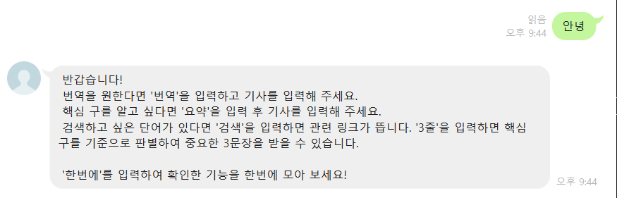
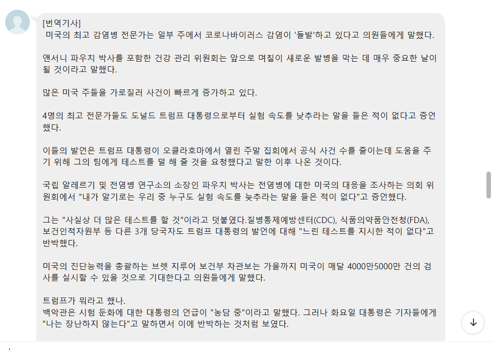
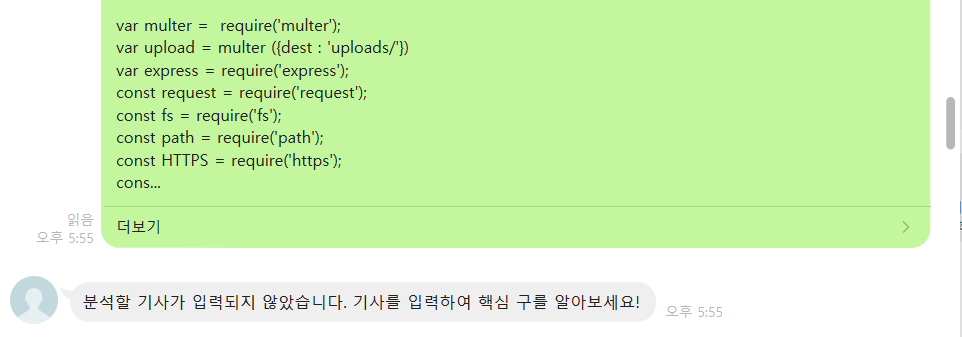

# 라인을 통해 정보를 쉽고 빠르게 획득하세요!

기사, 논문, 포스팅을 라인 메세지로 보내 핵심 구, 번역본, 관련어 검색을 한번에 얻을 수 있습니다.
3줄 요약을 통해 더더욱 빠르게 정보를 얻으세요!

이 프로젝트는 *Papago*, *Azure*, *Line* api를 이용합니다.


## Table of Contents

* [About the Project](#about-the-project)
  * [Built With](#built-with)
* [Getting Started](#getting-started)
  * [Prerequisites](#prerequisites)
  * [Installation](#installation)
* [Usage](#usage)
* [License](#license)
* [Contact](#contact)


## About The Project

한국어로 된 기사나 논문은 훑어서 맥락을 파악할 수 있지만 영어로 되어있는 글에서 정보를 빠르게 얻기는 쉽지 않습니다.
이 프로젝트는 그러한 어려움을 느끼는 사용자에게 다양한 기능을 제공하여 어떠한 글에서도 빠른 정보를 얻을 수 있게 도와줍니다.


### Built With

* [Nodejs](https://nodejs.org/en/)
* [Line API](https://developers.line.biz/en/services/messaging-api/)
* [Azure API](https://docs.microsoft.com/ko-kr/azure/cognitive-services/text-analytics/)
* [Papago API](https://developers.naver.com/docs/papago/README.md#%ED%8C%8C%ED%8C%8C%EA%B3%A0)

nodejs의 버전은 12.17.0 입니다.


## Getting Started

 
 
라인에 접속하여 @904davum 를 검색해 *SpeedyInfoGet*를 친구로 추가해주세요. 또는 QR코드로 추가할 수 있습니다.


### Prerequisites

다음 사이트에서 API에 넣어야 할 ID와 SECRET을 신청하세요

* [Line API](https://developers.line.biz/en/services/messaging-api/)
* [Azure API](https://docs.microsoft.com/ko-kr/azure/cognitive-services/text-analytics/)
* [Papago API](https://developers.naver.com/docs/papago/README.md#%ED%8C%8C%ED%8C%8C%EA%B3%A0)

### Installation

 1. Clone the repository

```javascript
git clone http://khuhub.khu.ac.kr/satelliteheart29/speedyInfoGet.git
```

 2. Install NPM packages

```javascript
npm install npm@6.14.4
npm install express
npm install request
```

 3. Enter your API

```javascript
const TOKEN ='[line channel access token]'
const PAPAGO_ID = '[papago_id]'
const PAPAGO_SECRET = '[papago_secret]'
const subscription_key = '[azure_subscription_key]'
```
 4. Run speedyinfoget.js

```javascript
node speedyinfoget.js
```


## Usage





처음 시작시 아무 거나 입력하거나 "안녕"을 입력해 안내 메세지를 확인할 수 있습니다.
만약 안내 메세지 없이 바로 기능에 들어가고 싶다면 "번역"을 입력해 주세요.


 


1. 번역

    1.1 "번역"을 입력하고 번역하고 싶은 글을 입력하세요. 번역된 글을 확인할 수 있습니다.

2. 요약

    2.1 "요약"을 입력하고 요약하고 싶은 글을 입력하세요. 관련도 높은 6개의 핵심 어구를 확인할 수 있습니다.

    2.2 3줄 요약된 문장을 보고 싶다면 "3줄"을 입력하세요. (글은 다시 입력하지 않아도 됩니다.) 핵심 어구를 통해 선별하여 가장 핵심이 되는 3 문장을 확인할 수 있습니다.
    
    2.3 핵심 어구에 대해 더 알아보고 싶다면 "검색"을 입력하세요. (글은 다시 입력하지 않아도 됩니다.) 핵심 어구를 검색한 링크를 받아 보실 수 있습니다.


 
 
 
3. 한 번에 확인하기

    3.1 결과를 한 번에 확인하려면 원하는 기능의 단계를 거치고 마지막에 "한번에"를 입력해주세요. 번역 결과, 요약 결과를 한 텍스트로 확인할 수 있습니다.





모든 잘못된 입력은 메세지를 통해 확인할 수 있습니다. 정확한 입력어를 다시 넣어주세요!


## License

MIT License 를 따릅니다. [License](http://khuhub.khu.ac.kr/satelliteheart29/speedyInfoGet/blob/7fe60a83980ca630b85fbf5eb70fc00d2632fcbb/license.txt)를 확인하세요.


## Contact

InKyung Huh red131729@khu.ac.kr

Project Link: [http://khuhub.khu.ac.kr/satelliteheart29/speedyInfoGet.git] (http://khuhub.khu.ac.kr/satelliteheart29/speedyInfoGet.git)
